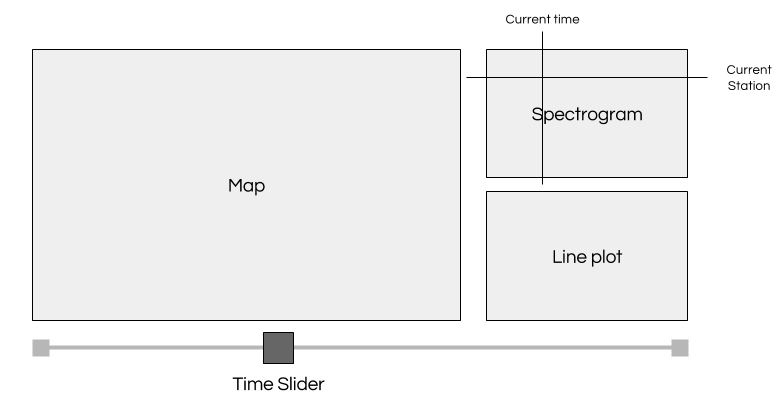

# Final Project: LIS590DV - Fall 2017

Your final project is composed of four parts.  You will work in groups of three
or four people; each person will be expected to participate in the project.

Note that in some cases, the descriptions of *what* you are to visualize are
somewhat vague.  This is in keeping with our discussion of carefully choosing
the story you want to tell.  You're going to be called upon in this assignment
to examine the data, and then within the rough outlines of the discussion,
construct a visualization that "answers" the posed question.

There are a few important notes:

 * All of the source code must be provided.
 * Use GitHub to version your code and your writeup.  This will also be used to
   verify individual contributions.
 * The writeup will be evaluated.
 * A "visualization" does not mean a single plot; it is broadly defined to
   include linked visualizations, collections of plots, etc.

## Component 1: Transportable Array Interactive

**Concept**: Show the how the transportable array responded to an earthquake.

Your first dataset will be based on data from the transportable array, for the
four hours following the Tohoku earthquake.  This data is available in two
files on the LIS590 server, under the directory
`/srv/nbgrader/data/transportable_array`.

 * `location.txt` is a tsv containing the latitude and longitude.  The final
   two columns are irrelevant data and can be discarded.
 * `data_tohoku_norm_transpose.csv` is a csv containing each of the 438
   stations in a column, and each row is subsequent seconds from the
   earthquake.

You will make one interactive visualization.  This should have a map, a time
slider, a spectrogram, and a line plot of the currently selected detector.

A spectrogram is a visualization in which a 2D array is created, showing the
normalized values from a collection of 1D arrays.  In principle, the input from
the `data_tohoku_norm_transpose.csv` file can be very easily converted into
this.  However, this will give an odd stratification of the array detectors,
because they're just ordered however they are in the file.  Instead, you should
create a *new* ordering of the array detectors.  Compute (you can use the
`haversine` package) the distance from the Tohoku quake itself, and use this to
order the detectors from closest to furthest.  Order them this way in the
spectrogram.

Display the locations of each detector in the transportable array on a map of
the United States; the color of each mark should represent the value of the
wave at the currently selected time.

The waveform of each selected detector (selected by hovering, selecting from a
dropdown, or by clicking on a detector) should be displayed as a line plot.

Annotate the spectrogram to indicate current time and selected detector.

 * Extra: Turn each into audio.  (Don't autoplay though.)

## Component 2: Transportable Array Movie

Make a time-varying visualization of the transportable array and how it
responds to an earthquake.  You will be graded on the information that is
communicated and the aesthetics.

This does not have to be a strictly quantitative visualization, and it can be
done in any software.  You may choose to augment this with 

Your writeup of this should *very* clearly state what you intend for
individuals to get out of the visualization as well as how you did it.  Because
this is an open-ended problem, by design, you *must* describe what you intended
to communicate.

This should be uploaded to mediaspace.illinois.edu and any source code placed
in this repository.

## Component 3: TBA

## Component 4: TBA

## Final Writeup

You will be tasked with providing a writeup of your visualizations as well.
Each should be in markdown form and in the directory with your visualizations.
These should describe in some detail:

 * Why you took the approach you did
 * Strengths of your approach
 * Weaknesses of your approach
 * What you wished you had been able to do (if anything)
 * Who in the group contributed each part of the visualization (from code, data
   management, data cleaning, writeup, and so on.)
